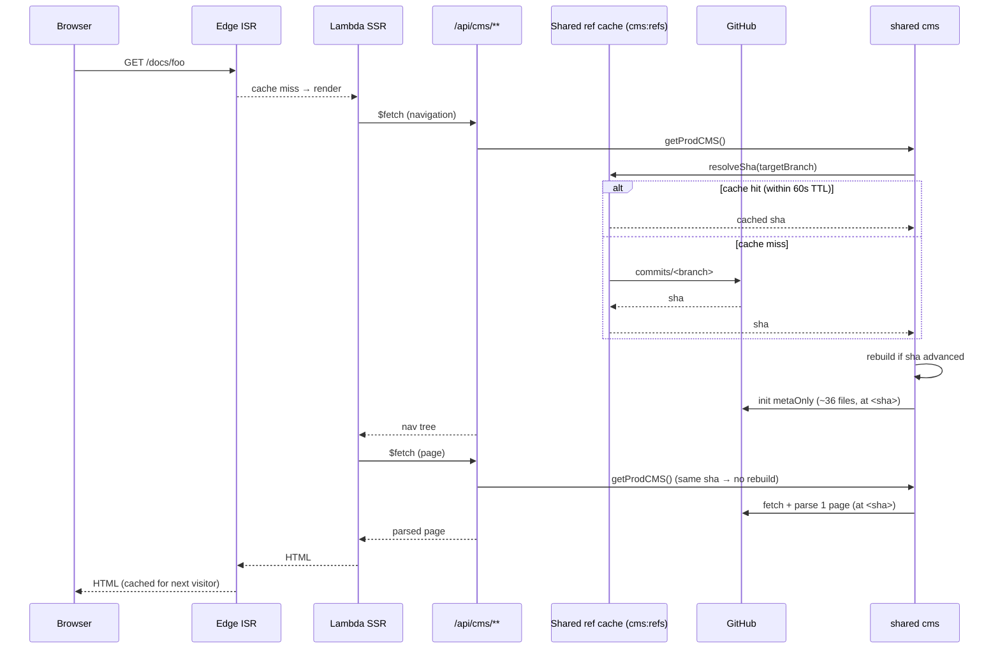

# Cold page request

First visitor to a page after deploy or ISR cache expiry.

**Cost:** one shared-cache lookup for the branch tip (GitHub is only hit once per
60s TTL window across *all* instances/regions, not per instance) + the instance
builds its index from GitHub once per head, then one page parse. All reads
pinned to the immutable `<sha>`.

**On a content push**, `server/api/revalidate.post.ts` writes the new SHA
directly into the same shared ref cache (`cacheSha()`) before fanning out ISR
purges for the affected pages, so a freshly-purged page's next render already
sees the new SHA instead of waiting out the 60s TTL.
