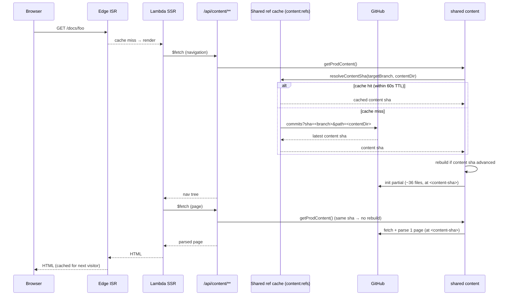

# Cold page request

First visitor to a page after deploy or ISR cache expiry.

**Cost:** one shared-cache lookup for the latest commit touching the content directory + the
instance builds its index from GitHub once per content revision, then one page parse. All reads
are pinned to the immutable `<content-sha>`. Code-only commits do not rebuild the content instance.

The ref cache is shared across *instances*, so GitHub is hit once per 60s TTL window
rather than once per cold start. It is **not** shared across regions — Vercel's
Runtime Cache is regional (see the note on `refCacheDriver()` in
`server/utils/cache.ts`), so the ceiling is one GitHub call per region per window.
This project runs single-region, which is what makes that distinction academic today.

A ref that doesn't resolve is cached too, for the same window, but **only** when the
caller asks for it (`resolveContentSha(ref, contentDir, { cacheMisses: true })`) — the public
`/tree/:branch` route does, so a nonexistent branch can't be replayed into one
GitHub API call per request. The production branch above deliberately does not:
GitHub answers 404 when a token loses access to a private repo, and caching that
would turn an expired token into a site-wide outage for the window rather than one
failed request.

**On a content push**, `server/api/revalidate.post.ts` forces a fresh `resolveContentSha()` lookup,
which writes the latest content SHA into the same shared ref cache before fanning out ISR
purges for the affected pages, so a freshly-purged page's next render already
sees the new SHA instead of waiting out the 60s TTL.

Parsed manifests and bodies live under a deployment-revision + content-SHA namespace. Vercel
Runtime Cache persists across deployments within an environment, so the deployment component keeps
new parser or plugin code from restoring artifacts produced by an older deployment.
