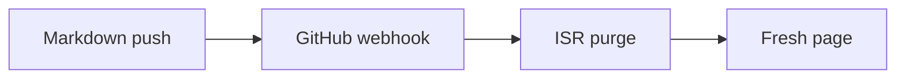

comark-docs is a [Nuxt layer](https://nuxt.com/docs/getting-started/layers) for documentation sites, powered by [`comark-content`](https://content.comark.dev). It runs the docs for [Comark](https://comark.dev), [Comark Content](https://content.comark.dev), and [devfra.me](https://devfra.me) — including the site you're reading now.

Most docs frameworks bundle Markdown into the build, so every typo fix means a redeploy. With comark-docs, content lives as Markdown in your repository and is fetched, parsed, and cached **at request time**. Push to your production branch and the change is live in seconds — no build, no deploy.

## How it works

In development, pages are read from your working tree with hot reload. In production, they're read from GitHub, pinned to a commit SHA, and cached at two levels: parsed Markdown bodies in a runtime cache and rendered HTML at the edge with [ISR](https://vercel.com/docs/incremental-static-regeneration).

A GitHub webhook notifies the site on push, which purges the cached pages. Because content is addressed by commit, any branch or commit can also be previewed live at `/tree/:branch` or `/blob/:sha` — see [Versioned previews](/concepts/versioned-previews).

## What's included

- **Instant production content** — GitHub-sourced Markdown, ISR-cached HTML, revalidated on push.
- **Versioned previews** — browse any branch or commit of your docs through versioned URLs.
- **Docs UI** built with [Nuxt UI](https://ui.nuxt.com): sidebar navigation, search (`⌘K`), table of contents, prev/next links, and a version history panel.
- **SEO out of the box** — sitemap, robots, canonical URLs, OG images, and JSON-LD structured data.
- **AI-native** — `llms.txt`, raw Markdown mirrors (`/raw/**`), an MCP server (`/mcp`), an optional "Ask AI" assistant, and [Agent Skills](https://agentskills.io) discovery.

## Keyboard shortcuts

Every site built with the layer ships these shortcuts — try them on this page:

| Keys | Action |
| --- | --- |
| :kbd{value="meta"} :kbd{value="K"} | Open search |
| :kbd{value="D"} | Toggle dark mode |
| :kbd{value="G"} :kbd{value="H"} | Toggle the version history panel |

Single-key shortcuts are ignored while an input is focused, so they never conflict with typing.

## Next steps

::card-group
  :::card{icon="i-lucide-download" title="Installation" to="/getting-started/installation"}
  Add the layer to a Nuxt app and write your first page.
  :::

  :::card{icon="i-lucide-settings" title="Configuration" to="/getting-started/configuration"}
  Branding, navigation tabs, and environment variables.
  :::

  :::card{icon="i-lucide-pen-line" title="Writing pages" to="/writing/pages"}
  Structure your `content/` directory and frontmatter.
  :::

  :::card{icon="i-lucide-rocket" title="Deploy on Vercel" to="/deployment/vercel"}
  Wire up the webhook and skip redeploys for content pushes.
  :::
::
