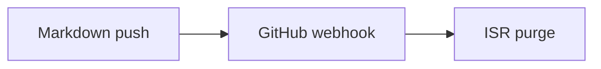

Beyond plain [Markdown](/writing/markdown), pages can use Vue components through the [MDC syntax](https://comark.dev/syntax/components): a block component is written as `::component-name`, closed with `::`, and nested components add one colon per level (`:::child`).

Three kinds of components are available in docs pages:

- **Nuxt UI prose components** — callouts, tabs, steps, and code widgets, available without any prefix.
- **Nuxt UI components** — any [Nuxt UI](https://ui.nuxt.com) component, with the `u-` prefix (`::u-button`).
- **Layer components** — `Mermaid`, `CodeExplorer`, and `Browser`, injected by the docs page.

## Prose components

The layer enables [Nuxt UI typography](https://ui.nuxt.com/docs/typography), so every prose component works out of the box. The ones you'll reach for most:

### Callouts

::code-preview
::note
Bodies are parsed lazily on `get()`.
::
::warning
This feature is experimental.
::
#code
```mdc
::note
Bodies are parsed lazily on `get()`.
::
::warning
This feature is experimental.
::
```
::

Variants: `::note`, `::tip`, `::warning`, `::caution`, and a generic `::callout{icon="i-lucide-info" to="/some/page"}`.

### Code groups

One fenced block per tab, labeled with `[...]`:

::code-preview
::code-group
```bash [pnpm]
pnpm add comark-docs@github:comarkdown/comark-docs
```
```bash [npm]
npm install comark-docs@github:comarkdown/comark-docs
```
::
#code
````mdc
::code-group
```bash [pnpm]
pnpm add comark-docs@github:comarkdown/comark-docs
```
```bash [npm]
npm install comark-docs@github:comarkdown/comark-docs
```
::
````
::

### Cards

::code-preview
::card-group
  ::card{icon="i-lucide-rocket" title="Fast" to="/concepts/architecture"}
  Parses on demand, caches by commit.
  ::
  ::card{icon="i-lucide-git-branch" title="Versioned"}
  Preview any branch or commit.
  ::
::
#code
```mdc
::card-group
  ::card{icon="i-lucide-rocket" title="Fast" to="/concepts/architecture"}
  Parses on demand, caches by commit.
  ::

  ::card{icon="i-lucide-git-branch" title="Versioned"}
  Preview any branch or commit.
  ::
::
```
::

### Steps

Wrap a sequence of `###` headings to render a numbered procedure:

::code-preview
::steps{level="3"}
### Install the layer

This is the first step.

### Extend your config

This is the second step.

### Write a page

This is the third step.
::
#code
```mdc
::steps{level="3"}
### Install the layer

This is the first step.

### Extend your config

This is the second step.

### Write a page

This is the third step.
::
```

::

Other useful ones: `::tabs` with `:::tabs-item{label="..."}` children, `::collapsible`, `::accordion`, `::code-preview` (rendered output next to its source), and `::code-collapse`. See the [Nuxt UI typography docs](https://ui.nuxt.com/docs/typography) for the full list and props.

## Nuxt UI components

Any Nuxt UI component works with the `u-` prefix. The [landing page](/writing/landing-page) uses this for its hero:

::code-preview
::u-button
---
to: /getting-started/introduction
trailing-icon: i-lucide-arrow-right
---
Get started
::
#code
```mdc
::u-button
---
to: /getting-started/introduction
trailing-icon: i-lucide-arrow-right
---
Get started
::
```
::

## Mermaid diagrams

Write a ` ```mermaid ` code fence and it renders as a diagram, themed for both color modes:

::code-preview

#code
````mdc

````
::

## CodeExplorer

`::code-explorer` embeds a browsable file tree from a GitHub repository, with syntax-highlighted file contents — useful for walking readers through an example project:

::code-preview
::code-explorer
---
org: comarkdown
repo: comark-docs
path: playground/content
default-value: index.md
---
::
#code
```mdc
::code-explorer
---
org: comarkdown
repo: comark-docs
path: playground/content
default-value: index.md
---
::
```
::

| Prop | Type | Default | Purpose |
| --- | --- | --- | --- |
| `org` | `string` | required | GitHub organization or user. |
| `repo` | `string` | required | Repository name. |
| `path` | `string` | required | Directory to explore, relative to the repository root. |
| `branch` | `string` | `'main'` | Branch to read from. |
| `default-value` | `string` | first file | Path of the file selected on load. |

::warning
The server only fetches from your own content repository by default. To embed another repository, add it to [`comarkDocs.codeExplorer.allowRepos`](/getting-started/configuration#nuxtconfigts-comarkdocs-options).
::

## Browser

`::browser` frames a live site in browser chrome — traffic lights, a URL bar, and an open-in-new-tab button around a lazy-loaded `<iframe>`:

::code-preview
::browser{src="https://docs-template.comark.dev"}
::
#code
```mdc
::browser{src="https://docs-template.comark.dev"}
::
```
::

| Prop | Type | Default | Purpose |
| --- | --- | --- | --- |
| `src` | `string` | required | URL loaded in the iframe and shown in the address bar. |

## Next steps

- [Landing page](/writing/landing-page) — the hero, feature grids, FAQ, and CTA components for `index.md`.
