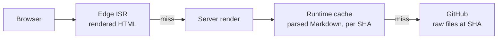
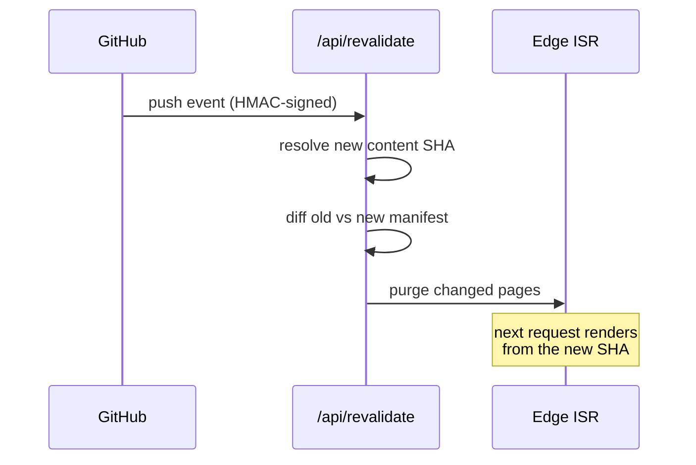

Most docs frameworks parse Markdown at build time and bundle the result. comark-docs does it at request time instead: pages are fetched from GitHub, parsed on demand, and cached aggressively. This page explains the moving parts.

## Serving modes

Every page exists in three modes, selected by the URL:

| Mode | URL | Content |
| --- | --- | --- |
| prod | `/getting-started/introduction` | pinned production SHA |
| tree | `/tree/main/getting-started/introduction` | latest content commit on the branch |
| blob | `/blob/<sha>/getting-started/introduction` | immutable commit preview |

Production and previews use the same rendering pipeline — see [Versioned previews](/concepts/versioned-previews) for the `tree` and `blob` modes.

In development, none of this applies: content is read straight from your working tree with hot reload.

## Pinned to a commit

Production doesn't read "whatever is on `main` right now." On each server render, comark-docs first checks a connected Vercel Global Config store for a `contentSha` value. When the value exists, every production content read is pinned to that commit. You can use this override to hold production on a reviewed version or roll content back without changing the production branch. See [Pin production content](/deployment/vercel#pin-production-content) for setup and cache timing.

Without a `contentSha` value, the server resolves the latest commit **touching the content directory** on the production branch. A shared, 60-second-TTL cache keeps this to about one GitHub call per minute. If Global Config is unavailable, comark-docs also falls back to this branch-based resolution.

The Global Config pin applies only to the production Vercel environment. Preview deployments continue to follow their target branch, and local development reads from your working tree.

Pinning buys two things:

- **Consistency** — a request never mixes files from two commits, even mid-push.
- **Cacheability** — content at a SHA can never change, so parsed pages are cached hard.

When no Global Config pin is active, code-only commits don't move the content SHA, so they don't invalidate anything.

## Cache tiers

1. **ISR** — rendered HTML is cached at the edge. Pages expire after `comarkDocs.isr` seconds (default 300) or when a push purges them.
2. **Runtime cache** — parsed Markdown bodies and the content manifest, keyed by parser version and content SHA. Because SHAs are immutable, these entries survive deployments and are shared across preview modes.
3. **GitHub** — the source of truth. Only hit on cold caches, and always at a pinned SHA.

A cold page costs one GitHub lookup for the SHA, one manifest read, and one page parse. A warm page costs nothing — it's served from the edge.

## Revalidation on push

When you push to the production branch, a GitHub webhook calls `/api/revalidate`:

The handler verifies the webhook signature with `WEBHOOK_SECRET`, resolves the new content SHA, diffs the file manifests to find affected pages, and purges exactly those from the ISR cache. The next request renders from the new commit — typically live within seconds of the push.

Without the webhook, the site still updates: ISR entries expire on their own after the `isr` window. The webhook just makes it immediate.

## Markdown for agents

Every production documentation page is mirrored as raw Markdown at `/raw/<path>.md` ([versioned previews](/concepts/versioned-previews) serve HTML only). The mirrors carry the same ISR caching as the HTML pages. This part of the site is [nuxt-agent-discovery](https://github.com/benjamincanac/nuxt-agent-discovery), reading the same `comark-content` instance that renders the HTML.

Agents don't need to know the mirror URLs. A page URL answers Markdown when the request sends `Accept: text/markdown`, appends `.md` to the path, or comes from a known agent user agent (ClaudeBot, GPTBot, PerplexityBot and the rest of the [ai.robots.txt](https://github.com/ai-robots-txt/ai.robots.txt) list). `/` answers the landing page followed by a *Resources for Agents* list of the discovery documents.

On Vercel the negotiation runs at the edge, before the ISR cache sees the request. A cached page 307-redirects to its `/raw/**` mirror rather than being rewritten: the ISR cache is keyed on the request path alone and ignores `Vary`, so serving both variants under one URL would let them overwrite each other's cache entry. Follow redirects when fetching, e.g. `curl -L`. In development the same negotiation runs in a Nitro middleware and answers in place.

A request for a page that doesn't exist returns a real HTTP 404 with a short Markdown body pointing at the discovery documents, so an agent that guesses a URL wrong can recover. The same documents are advertised in a `Link` header on `/` and in `/.well-known/api-catalog`: `/llms.txt` and `/llms-full.txt`, `/sitemap.md` (every page, grouped by section), `/openapi.json`, the MCP server card at `/.well-known/mcp/server-card.json`, and the [Agent Skills](/getting-started/configuration#agentdiscovery-options) index. `robots.txt` allows the same agent list.

## No redeploys for content

Since content never ships in the build, a content-only push doesn't need a deployment at all. On Vercel, an [Ignored Build Step](/deployment/vercel#setup-skip-builds-for-content-pushes) cancels builds for pushes that only touch `content/` — the webhook handles those. Code pushes build and deploy as usual.
